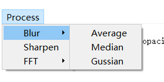

# MediclaVis

可视化数据处理桌面软件<br>
***
**建议使用pycharm开发**<br>
**data文件夹下有测试数据**<br>
所需包： pyqt5, pyvista, pyvistaqt, opencv, simpleITK<br>
通过`pip install -r requirements.txt`安装包

***
## 项目结构

- main.py 主函数运行
- Manager.py
  - DataManager: 数据处理类(读入写入等）
- MyWidget.py GUI 组件
  - MenuBar: 菜单栏
  - ConfigWidget: 参数调整组件
  - MyWindow: 窗口组件

## 添加功能步骤

### 菜单栏添加功能

1. 在MenuBar类的 `menuNameDict` 中添加相关菜单栏名，命名方式如下：
   `{} `代表一个菜单，`[] `对应菜单内每一个的功能。比如

   ```
   self.menuNameDict = {'Process': [
                         {'Blur': ['Average', 'Median', 'Gussian']},
                         'Sharpen',
                          {'FFT': ['FFT', 'Inverse FFT']}
                         ]}

   ```

   对应的菜单如下图所示 <br>
   <br>
   (若不理解可以运行程序与代码对应)
2. 在MenuBar类的 `actionTriggerDict`添加相关功能对应函数名，如添加 `Inverse FFT`菜单功能名,对应写入 `self.inverse_fft`
3. 在MenuBar类和DataManager类中添加对应的函数,DataManager负责数据处理，MenuBar类通过内部属性self.dataManager调用相关函数。
4. 数据通过DataManager处理完成之后打包成`DataManager`对象返回给MenuBar，调用`self.displayInOtherWindow(dataManager)`将处理后的数据在新窗口中显示。

***
MenuBar中有两个重要对象`window`和`dataManager`:<br>
- `window`对应于菜单栏所在的窗口，调用`self.window.display()` 可以显示window相关数据
- `dataManager` 有相关数据处理和读入函数，具体可看代码。
***

## 相关文档
<https://docs.pyvista.org/examples/02-plot/volume.html><br>
<https://blog.csdn.net/jiaoyangwm/article/details/79746157>